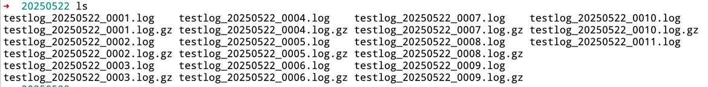

# vortexrotate
基于Go实现的文件写入、轮转库，支持多种压缩算法、过期文件管理、复杂轮转策略。

- 压缩算法：
  
  - GZIP压缩：支持压缩等级设置
  ```text
         GzipBestSpeed          = gzip.BestSpeed
         GzipBestCompression    = gzip.BestCompression
         GzipDefaultCompression = gzip.DefaultCompression
         GzipHuffmanOnly        = gzip.HuffmanOnly
  ```
  - ZSTD压缩：默认压缩等级，gozstd.DefaultCompressionLevel
  - Snappy压缩：不支持等级设置
- 文件轮转策略
    采用复杂的文件轮转策略，实现文件大小限制和定时轮转的混合轮转策略，每次Write()都会调用轮转器来
判断是否需要执行文件轮转，不需要直接写入，需要则执行轮转。轮转器内部封装定时任务，每隔固定间隔执行判
断是否轮转，如果需要轮转则以事件的方式向通知通道发送一条轮转事件，异步goroutine接收到信号执行轮转。
定时轮转判断时需要获取到上次轮转的事件以及当前文件写入的大小，当当前文件的写入数据很少时，跳过轮转，
只有当当前文件写入超过了最大大小的80%，才可以执行轮转，防止写入轮转和定时轮转间隔过短触发的频发轮转
操作。 Write触发的轮转优先级高于定时任务，定时轮转支持的时间级别：
```text
    Hour    TimingType = "hour"
    Day     TimingType = "day"
    Week    TimingType = "week"
    Month   TimingType = "month"
```
用法如下：
```go
package main

import (
	"fmt"
	"sync"
	"time"

	vr "github.com/TimeWtr/vortexrotate"
	"golang.org/x/net/context"
	"golang.org/x/sync/semaphore"
)

func main() {
	rotate, err := vr.NewRotator("./logs",
		"testlog.log",
		// 压缩配置
		vr.WithCompress(vr.CompressTypeGzip, vr.GzipBestSpeed),
		// 轮转配置：单个文件大小限制、定时任务时间级别
		vr.WithRotate(1024*1024*3, vr.Hour),
		// 保存的最大文件数量
		vr.WithMaxCount(1024))
	if err != nil {
		panic(err)
	}
	defer rotate.Close()

	sem := semaphore.NewWeighted(100)
	template := "测试数据，需要写入文件中，当前写入编号为：%d，测试内容。。。。。。。。。。\n"
	var wg sync.WaitGroup
	for i := 0; i < 300000; i++ {
		ctx, cancel := context.WithTimeout(context.Background(), time.Second*10)
		err = sem.Acquire(ctx, 1)
		cancel()

		wg.Add(1)
		go func(idx int) {
			defer wg.Done()

			defer sem.Release(1)

			c := fmt.Sprintf(template, idx)
			_, localErr := rotate.Write([]byte(c))
			if localErr != nil {
				fmt.Println("轮转写入失败，错误：", localErr)
			}
		}(i)
	}

	wg.Wait()
}
```

执行结果如下图所示：

